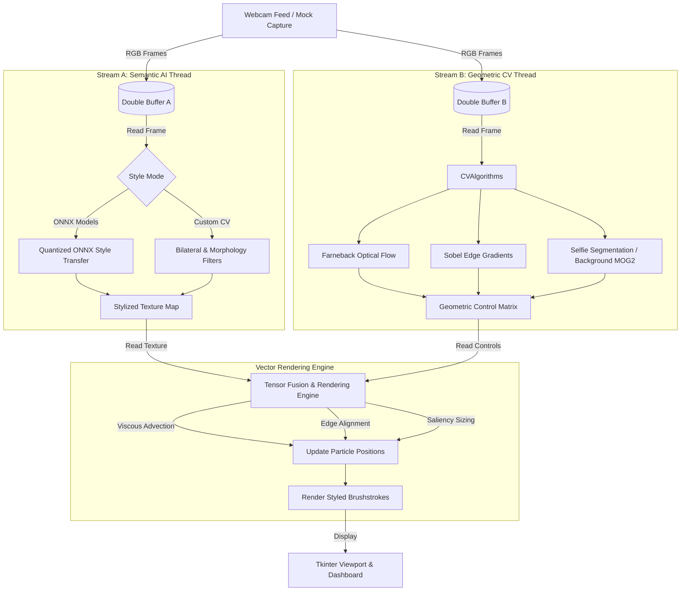

# 🎨 The Living Canvas

### Real-Time Interactive Video-to-Vector Art Pipeline

[](https://www.python.org/)
[](LICENSE)
[](#performance-targets)

The Living Canvas is a real-time interactive graphics system that transforms a live webcam feed into a dynamic, physics-based vector art simulation. Instead of treating video as a collection of pixels, the system interprets each frame as a fluid canvas where virtual brushstrokes respond to motion, edges, and visual saliency.

The project combines Computer Vision, Digital Signal Processing, and quantized Neural Style Transfer to create a responsive, CPU-friendly artistic experience running at real-time frame rates on consumer-grade hardware.

---

## 🏛️ System Architecture

The system utilizes a **Dual-Stream Engine** architecture that runs semantic AI and geometric CV algorithms in parallel threads to maximize CPU utilization and prevent frames from queuing.



---

## ✨ Key Features

*   **Real-Time Neural Style Transfer**: Employs optimized, quantized INT8 Feed-Forward Style Networks (including *Starry Night*, *The Scream*, and *Modernist Geometric*) executing on the CPU in less than 20ms.
*   **Dense Optical Flow-Based Paint Smearing**: Uses the Farneback algorithm to estimate pixel motion vectors, advecting virtual paint particles to simulate fluid, responsive brush movements.
*   **Saliency-Biased Adaptive Brush Assignment**: Leverages MediaPipe Selfie Segmentation (with an automatic OpenCV MOG2 background subtraction fallback) to render fine brushstrokes on foreground subjects and coarse brushstrokes in the background.
*   **Edge-Aware Contour Alignment**: Computes Sobel gradient angles to automatically align brushstrokes perpendicular to scene contours, preserving visual boundaries.
*   **Custom Computer Vision Filters**: Offers non-deep-learning artistic filters such as Cel-Shaded *Cartoon*, *Oil Pastel Painting*, *Line Drawing* (charcoal outline sketching), and *ASCII Character Vision*.
*   **Multi-Threaded Processing Pipeline**: Decouples webcam grabbing, semantic style transfer (Stream A), and geometric feature extraction (Stream B) using thread-safe double buffers.
*   **Diagnostics Dashboard & Telemetry**: Includes an interactive Tkinter UI featuring a 2x2 grid showing the source feed, HSV optical flow, Sobel edges, and saliency masks, along with real-time performance indicators (FPS, latency, memory footprint).

---

## 📂 Project Structure

```text
LivingCanvas/
├── main.py                 # Application entry point, mock camera simulation, thread orchestration
├── verify_engine.py       # Offline verification test suite for ONNX and CV pipelines
├── requirements.txt        # Core package dependencies
├── LICENSE                 # License file
├── PRD.me                  # Product Requirements Document
├── models/                 # Downloaded ONNX style model storage (created dynamically)
└── src/
    ├── __init__.py         # Package initializer
    ├── config.py           # Resolution settings, filter thresholds, default parameters
    ├── model_manager.py    # Remote model downloader and ONNX execution session builder
    ├── stream_a.py         # Semantic AI stream thread (ONNX inference & CV styles)
    ├── stream_b.py         # Geometric CV stream thread (Optical flow, Edges, Saliency)
    ├── engine.py           # Vector rendering engine, particle simulation & brush drawing
    ├── dashboard.py        # Composite diagnostic grid constructor and performance metrics
    ├── ui.py               # Tkinter window layout, widgets, and styles
    └── utils.py            # DoubleBuffer and FrameTimer utilities
```

---

## 🚀 Getting Started

### 📋 Prerequisites
The project is built and tested for **Python 3.10+** on standard Windows configurations. 

### 🔧 Installation

1.  **Clone or navigate** to the project directory:
    ```bash
    cd LivingCanvas
    ```

2.  **Create and activate a virtual environment**:
    ```bash
    python -m venv venv
    
    # On Windows:
    .\venv\Scripts\activate
    ```

3.  **Install dependencies**:
    Ensure you install both the core dependencies and runtime GUI libraries:
    ```bash
    pip install -r requirements.txt
    pip install opencv-python Pillow
    ```

> [!NOTE]
> `opencv-python` and `Pillow` are required for video capture, image processing, and rendering in the Tkinter window.

---

## 🏃 Run the Application

### 🧪 Run Verification Checks
Before running the interactive application, you can execute the offline test suite to automatically download style models and verify that the CPU pipelines run successfully:
```bash
python verify_engine.py
```

### 🎨 Run the App
Launch the main application containing the interactive canvas and sidebar controller:
```bash
python main.py
```

> [!TIP]
> **No Webcam?** The system will print a warning and automatically activate **Mock Camera Feed** mode, generating moving shapes and synthetic noise to demonstrate the simulation without a physical webcam.

---

## 🧠 Core Algorithms

### 1. Paint Advection (Dense Optical Flow)
The rendering engine simulates fluid motion by updating particle coordinates using velocity components $(u, v)$ from the Farneback Optical Flow:
$$x(t+1) = x(t) + \alpha u$$
$$y(t+1) = y(t) + \alpha v$$
*Where $\alpha$ represents the fluid viscosity coefficient controlled in the UI.*

### 2. Edge-Aware Stroke Orientation
To keep strokes aligned with object boundaries, Sobel gradients $G_x, G_y$ are computed. The brushstroke orientation $\theta$ is rotated perpendicular to the gradient direction:
$$G = \sqrt{G_x^2 + G_y^2}$$
$$\phi = \text{atan2}(G_y, G_x)$$
$$\theta = \phi + \frac{\pi}{2}$$

### 3. Saliency-Biased Tournament Seeding
To allocate detail efficiently, when a particle ages out or goes out of bounds, it is reseeded using a tournament selection:
1. Two candidate locations are chosen randomly.
2. Saliency mask values are sampled at both locations.
3. The particle is spawned at the location with the higher saliency value, ensuring detail concentrates on moving/foreground elements.

---

## 🎛️ Interactive Controls & Telemetry

The Tkinter interface includes a dark-themed sidebar offering the following interactive options:

| Control Group | Parameter / Button | Description |
| :--- | :--- | :--- |
| **Artistic Style** | Style Dropdown | Switch between ONNX styles (*Starry Night*, *The Scream*, *Modernist Geometric*) and CV styles (*Cartoon*, *Oil Pastel*, *Line Drawing*, *ASCII Vision*). |
| **Brush Simulation** | Brush Density | Adjust the active particle pool size (from $500$ to $4000$). |
| **Brush Simulation** | Viscosity (Motion Speed) | Adjust $\alpha$ to accelerate or decelerate optical flow movement. |
| **Brush Simulation** | Edge Contour Alignment | Control how strongly brushstrokes align with Sobel edges. |
| **Brush Simulation** | Paint Fade Rate (Wetness)| Control how quickly paint fades, simulating wet paint persistence. |
| **View Mode** | View Mode Radios | Toggle between the **Artistic Canvas** and **Engineering Diagnostics** (2x2 grid). |
| **Canvas** | Clear Canvas | Immediately resets all particles and clears the canvas to white. |

### 📊 Real-Time Diagnostic Dashboard
When toggled to **Engineering Diagnostics**, the viewport displays:
1.  **Source (Grayscale)**: The current captured camera frame.
2.  **Dense Optical Flow (HSV)**: Visualizes motion vector directions as color hues and velocity magnitude as saturation.
3.  **Sobel Edge Direction**: Grayscale edge intensity mapped from Sobel gradients.
4.  **Saliency Segment (MediaPipe)**: Displays a magenta overlay highlighting the extracted foreground segment.

---

## ⚡ Performance Targets

The system is optimized for CPU-only execution:

| Metric | Target | Description |
| :--- | :--- | :--- |
| **FPS** | $\ge 30$ | Real-time interactive output |
| **End-to-End Latency** | $\le 33.3\text{ ms}$ | Frame input to canvas render delay |
| **Stream A Latency** | $\le 20\text{ ms}$ | Quantized ONNX model inference time |
| **Stream B Latency** | $\le 8\text{ ms}$ | CV calculations (flow, edges, mask) |
| **RAM Usage** | $\le 750\text{ MB}$ | Active memory footprint |

---

## 👨‍💻 Authors & License

*   **Design & Architecture**: Developed for academic and educational purposes.
*   **License**: Open-source, academic use.
